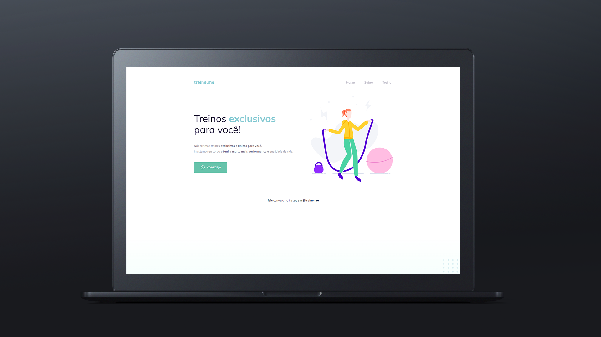

  

## 🖥️ Projeto
Esse é o projeto "Treine me" para você investir em treinos exclusivos. Esse projeto foi desenvolvido durante o Stage 02 do curso Explorer da Rockeatseat, com as seguintes tecnologias:

- HTML
- CSS
- Git e Github

Você pode acessar o projeto clicando [aqui](https://arauujo.github.io/treine-me/)

## 🔖 Layout
Você pode visualizar o layout do projeto através
[desse link](https://www.figma.com/file/C075YrAzLKS1BiftBzI58N/Projeto-02---Explorer-(Copy)).
É necessário ter uma conta no [Figma](https://www.figma.com).